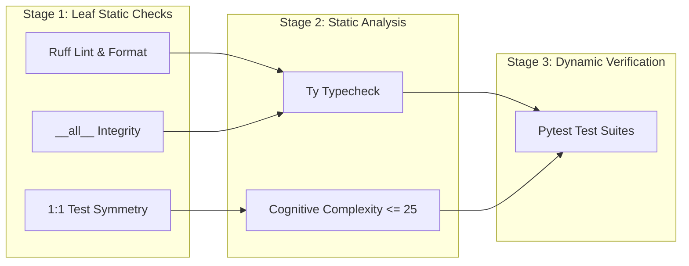

# 🛡️ Hexaqual

[](https://pypi.org/project/hexaqual/)
[](https://www.python.org/downloads/)
[](https://opensource.org/licenses/Apache-2.0)

> **Universal Python quality gates, architectural boundary enforcement, and release engineering toolchain.**

Hexaqual provides an opinionated, high-velocity quality harness designed for modular Python architectures, monorepos, and single-package projects. It unifies linting, type-checking, cognitive complexity enforcement, `__all__` integrity, 1:1 test symmetry, and automated PyPI release workflows into a cohesive, workflow-driven developer CLI.

---

## 🚀 Key Features

* **Workflow-Driven Sanity Checks**: Multi-stage DAG pipeline powered by [Hexaflow](https://pypi.org/project/hexaflow/) for parallel linting, typechecking, and testing.
* **Architectural Invariants**: First-class support for hexagonal layer enforcement (`domain`, `ports`, `adapters`, `infra`).
* **Test Parity Enforcement**: 1:1 symmetry verification between source modules and unit test suites.
* **Public API Integrity**: Automatic sorting, deduplication, and AST validation of `__all__` exports.
* **Smart PyPI Publishing**: Dependency-ordered, reproducible builds with automatic skip-if-exists checks.

---

## 📦 Installation

```bash
# Add as a development dependency
uv add --dev hexaqual

# Or install globally
uv tool install hexaqual
```

---

## 🛠️ Unified CLI (`hexaqual`)

Hexaqual subsumes all developer quality tools into a single unified entrypoint (`hexaqual`). It dynamically detects workspace layout:
- **Multi-package workspaces** (`packages/` exists): accepts `-p` / `--package` to filter focus across packages, or `-a` / `--all` for the whole workspace.
- **Single-package projects** (no `packages/`): automatically focuses on the root package without requiring `-p`.
- **Examples support**: if an `examples/` directory exists, `-e` / `--example` allows targeted auditing of example projects.

### Command Overview

| Command | Subcommands | Description |
|---|---|---|
| `hexaqual check` (alias: `sanity`) | — | Run the multi-stage quality pipeline (Ruff, Ty, Complexipy, `__all__`, test parity, pytest). |
| `hexaqual statements` | `check`, `fix` | Audit and auto-format `__all__` exports with strict casefold sorting. |
| `hexaqual parity` | `test`, `extras` | Audit 1:1 symmetry between source modules and unit tests, and optional extras forwarding. |
| `hexaqual test` | `run`, `boundary`, `redundancy`, `impact`, `fuzz`, `snapshot`, `archon` | Run pytest suites, boundary assertion audits, redundancy analysis, git impact tests, fuzzing, and inline snapshots. |
| `hexaqual mutate` | `run`, `inspect` | Execute mutation testing via mutmut and inspect critical surviving mutants. |
| `hexaqual release` | `build`, `check`, `publish`, `reproducible` | Build sdist/wheel distributions, verify metadata, and publish to PyPI with smart duplicate skipping. |
| `hexaqual gh` | `pr`, `checks`, `repo`, `security`, `code-scanning`, `codeql` | Inspect PR health dashboards, CI checks, repo governance, Dependabot, and CodeQL alerts. |
| `hexaqual deps` | `audit`, `deptry`, `graph` | Audit dependencies, run deptry checks, and generate dependency graphs via pydeps. |
| `hexaqual imports` | `check`, `generate` | Verify and generate import-linter contracts for hexagonal boundary enforcement. |
| `hexaqual refactor` | `alphabetize`, `rename`, `extract`, `move`, `run` | Automated code refactoring and AST-level symbol alphabetization via Rope. |
| `hexaqual docs` | `usage`, `publish` | Verify/regenerate USAGE.md catalogs and publish Medium articles. |
| `hexaqual complexity` | — | Audit cognitive complexity across functions and methods via complexipy. |

```bash
# Run sanity checks on specific packages in a workspace
hexaqual check -p core -p cqrs

# Run sanity check with auto-formatting on a single-package repo
hexaqual check --fix

# Audit __all__ integrity across all packages
hexaqual statements check

# Run pytest on tests impacted by recent git changes
hexaqual test impact

# Examine a GitHub Pull Request dashboard with live polling
hexaqual gh pr 42 --watch

# Verify USAGE.md catalog is up to date
hexaqual docs usage --check
```

For the complete unrolled CLI reference and full option listings for every subcommand, see [USAGE.md](USAGE.md).

---

## 🪝 Pre-Commit Integration

Add Hexaqual to your `.pre-commit-config.yaml` to enforce all static quality gates in under a second:

```yaml
repos:
  - repo: local
    hooks:
      - id: hexaqual-sanity
        name: hexaqual sanity check
        entry: uv run hexaqual sanity --skip-tests
        language: system
        pass_filenames: false
```

---

## 🐕 Dogfooding Hexaflow: Workflows as Architecture

Hexaqual serves as the primary real-world dogfooding ground for [Hexaflow](https://pypi.org/project/hexaflow/), demonstrating how lightweight, in-memory workflow DAGs can orchestrate high-performance developer tooling without complexity or latency.

### The Sanity Workflow DAG
Rather than executing checks in a rigid, monolithic sequence or maintaining ad-hoc shell orchestration, `hexaqual sanity` compiles each target's verification into a declarative `hexaflow.Workflow`:



### Why Dogfooding Hexaflow Matters:
1. **Deterministic Staging & Fail-Fast**: Ultra-fast leaf AST checks (Ruff, `__all__`, test symmetry) execute in Stage 1 (~0.05s), providing immediate feedback before heavier static analysis (Ty, complexipy) or test suites run.
2. **Granular Step Checkpoints**: Each verification step executes within a discrete `StepContext`, recording execution metrics, structured findings, and pass/fail states into an `InMemoryStateStore`.
3. **Zero-Latency Overhead**: Hexaflow's minimal runtime footprint adds virtually zero overhead—the entire 5-stage static check pipeline runs in under **0.6 seconds**.
4. **Resilient Error Isolation**: If a step fails, the workflow gracefully preserves partial reports, enabling the Rich presenter to render complete multi-target dashboards showing exact failure context.

---

## 🏛️ Architecture & Documentation

- **[Architecture & Design Guide](docs/ARCHITECTURE.md)**: Hexagonal boundaries, CQRS command bus, and architectural invariants.
- **[CLI Reference Catalog](USAGE.md)**: Full unrolled command and subcommand trees with exhaustive option listings.

---

## 📄 License

Apache-2.0. See [LICENSE](LICENSE) for details.
