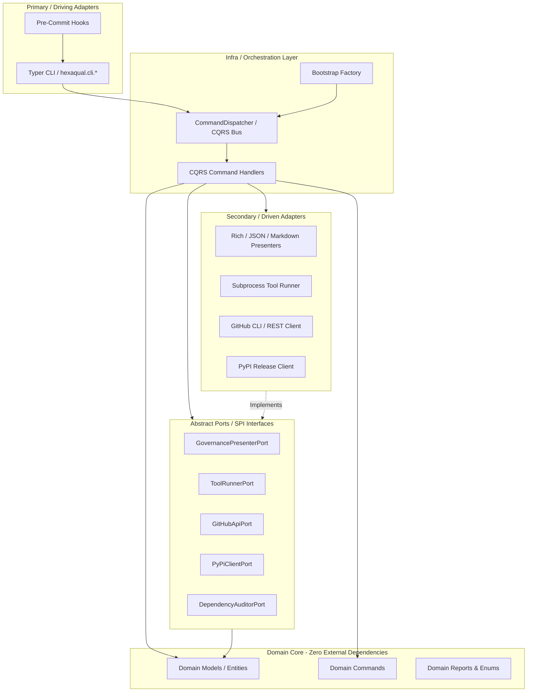

# 🏛️ Hexaqual Architecture & Design Guide

> **Architectural Intent**: Hexaqual is built strictly according to **Hexagonal Architecture (Ports and Adapters)** and **CQRS (Command Query Responsibility Segregation)** principles. It enforces clean architectural boundaries within its own codebase while providing the tooling to enforce them in other Python projects.

---

## 1. Hexagonal Layers & Dependency Flow

The system is organized into concentric layers with strict inbound dependency rules:



### Dependency Rules:
1. **Domain Core (`hexaqual.domain`)**: Pure Python models, command dataclasses, and enums. Contains zero framework dependencies (no CLI, no external tool runners, no subprocess calls).
2. **Ports (`hexaqual.ports`)**: Abstract ABC interfaces defining what the domain and handlers require from the outside world (presenters, runners, API clients).
3. **Adapters (`hexaqual.adapters`)**: Concrete implementations of ports:
   - `adapters/presenters/`: Terminal (Rich), JSON, and Markdown presentation formatters.
   - `adapters/runners/`: Execution of subprocess tools (`ruff`, `ty`, `pytest`, `complexipy`).
   - `adapters/clients/`: GitHub API (`gh`) and PyPI package publishing clients.
4. **CLI (`hexaqual.cli`)**: Driving adapters powered by Typer. They parse user inputs, construct domain commands, dispatch them across the CQRS bus, and delegate output rendering to adapters.
5. **Infra (`hexaqual.infra`)**: Plumbing, including the `CommandDispatcher`, command handler registries, and bootstrap wiring.
6. **Utils (`hexaqual.utils`)**: Shared low-level helpers for AST parsing, git status detection, workspace layout inspection, and `pyproject.toml` parsing.

---

## 2. Directory Layout

```text
src/hexaqual/
├── domain/                  # Pure domain entities, commands, and reports
│   ├── base.py              # Base Command and DomainModel primitives
│   ├── governance.py        # Sanity check findings, targets, and reports
│   ├── testing.py           # Test execution and coverage analysis models
│   ├── github.py            # PR summary, check run, and review models
│   ├── pypi.py              # Release metadata and package distribution models
│   ├── dependencies.py      # Dependency audit and import boundary models
│   └── generators.py        # Documentation and diagram generation contracts
├── ports/                   # Abstract Port interfaces (ABCs)
│   ├── governance.py        # GovernancePresenterPort, ToolRunnerPort
│   ├── testing.py           # TestingPresenterPort
│   ├── github.py            # GitHubApiPort, GitHubPresenterPort
│   ├── pypi.py              # PyPiClientPort, PyPiPresenterPort
│   └── dependencies.py      # DependencyAuditorPort
├── adapters/                # Concrete Port implementations
│   ├── presenters/          # Rich, JSON, and Markdown format presenters
│   ├── runners/             # Subprocess, coverage, and dependency runners
│   └── clients/             # GitHub CLI and PyPI HTTP adapters
├── cli/                     # Driving adapters (Modular Typer sub-applications)
│   ├── main.py              # Root Typer entrypoint mounting sub-apps
│   ├── check.py             # 'check' and 'sanity' commands
│   ├── statements.py        # 'statements' subcommands (check, fix)
│   ├── parity.py            # 'parity' subcommands (test, extras)
│   ├── test.py              # 'test' subcommands (run, boundary, impact, redundancy)
│   ├── mutate.py            # 'mutate' subcommands (run, inspect)
│   ├── release.py           # 'release' subcommands (build, check, publish, reproducible)
│   ├── gh.py                # 'gh' subcommands (pr, checks, repo, security, code-scanning)
│   └── docs.py              # 'docs' subcommands (usage)
├── infra/                   # CQRS bus and orchestration plumbing
│   ├── dispatcher.py        # Synchronous in-process command dispatcher
│   ├── bootstrap.py         # Factory assembling buses with default adapter wiring
│   └── handlers/            # Decoupled CQRS command handlers
└── utils/                   # Shared workspace, AST, and file inspection helpers
    ├── workspace.py         # Dynamic workspace root and package resolution
    ├── all_statements.py    # AST parser and casefold sorter for __all__
    ├── test_parity.py       # 1:1 source-to-test symmetry checker
    └── help_extractor.py    # BFS CLI command tree extractor
```

---

## 3. Core Architectural Invariants

Hexaqual enforces five non-negotiable quality invariants across both its own codebase and target client projects:

### Invariant 1: Layer Boundary Isolation
- `domain/` must never import from `ports/`, `adapters/`, `infra/`, or external runtime frameworks.
- `ports/` must never import from concrete `adapters/` or `infra/`.
- `adapters/` must never import from `infra/`.
- Driving adapters (`cli/`) only interact with domain commands and dispatchers.

### Invariant 2: 1:1 Test Parity & Symmetry
- Every non-init source module `src/<pkg>/<path>.py` requires a corresponding unit test `tests/unit/<path>/test_<name>.py`.
- Every subdirectory under `tests/unit/` must contain an `__init__.py` file.
- Verified in ~0.01s via `hexaqual parity test`.

### Invariant 3: Alphabetical `__all__` Casefold Integrity
- Every exported symbol in `__all__` lists must be sorted strictly casefold (`casefold()` sorting).
- Duplicate exports are prohibited.
- Verified via `hexaqual statements check` and autofixed via `hexaqual statements fix`.

### Invariant 4: Cognitive Complexity Ceiling
- No function or method may exceed a cognitive complexity score of **25** (measured by `complexipy`).
- Complex handlers must be decomposed into focused private helper functions.

### Invariant 5: Universal Dynamic Workspace Discovery
- Tools never hardcode project names or workspace structures.
- Detects multi-package monorepos (`packages/` or `tool.uv.workspace`) vs single-package standalone repositories.
- Detects example projects (`examples/`) and provides `-e` filtering automatically.

---

## 4. Pre-Commit Quality Pipeline

Hexaqual exposes a streamlined pre-commit hook that replaces multi-tool overhead with a single sub-second execution:

```yaml
# .pre-commit-config.yaml
repos:
  - repo: local
    hooks:
      - id: hexaqual-sanity
        name: hexaqual sanity check
        entry: uv run hexaqual sanity --skip-tests
        language: system
        pass_filenames: false
```

The sanity check runs 5 parallel static checks:
1. **Ruff Lint & Format**: Validates formatting and static style rules.
2. **Ty Typecheck**: Fast static type analysis of `src/`.
3. **Cognitive Complexity**: Ensures all methods stay <= 25.
4. **`__all__` Integrity**: Confirms public exports are deduplicated and casefold-sorted.
5. **Test Parity**: Guarantees complete 1:1 unit test symmetry.

When run with `hexaqual sanity` (without `--skip-tests`), it automatically appends execution of the target project's pytest test suite.
