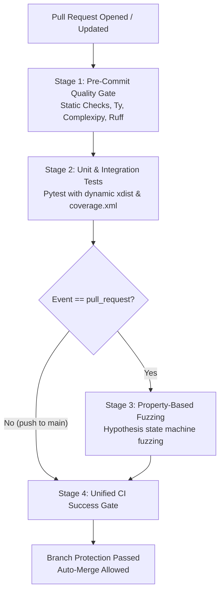

# 🔄 CI/CD & GitHub Actions Integration

Hexaqual powers automated quality gates, tiered CI pipelines, and reproducible supply-chain-secure release workflows across GitHub Actions.

---

## 🏗️ Tiered CI Pipeline Architecture

To minimize CI cycle time while maximizing rigor, Hexaqual organizes GitHub Actions workflows into four sequential stages:



### Stage 1: Fast Quality Gate (Pre-Commit)
Fails fast in under 15 seconds if any code style, typing, cognitive complexity, or structural parity violation exists:

```yaml
jobs:
  quality-gate:
    name: Pre-Commit Quality Gate
    runs-on: ubuntu-latest
    steps:
      - uses: actions/checkout@v4
      - uses: astral-sh/setup-uv@v5
        with:
          enable-cache: true
      - uses: actions/setup-python@v5
        with:
          python-version: "3.13"
      - run: uv sync --all-extras --dev
      - run: uv run pre-commit run --all-files
```

### Stage 2: Unit & Integration Tests with Coverage
Executes pytest with automated worker scaling and generates JUnit and XML coverage reports:

```yaml
  test-suite:
    name: Unit & Integration Tests
    needs: [quality-gate]
    runs-on: ubuntu-latest
    steps:
      - uses: actions/checkout@v4
      - uses: astral-sh/setup-uv@v5
      - uses: actions/setup-python@v5
        with:
          python-version: "3.13"
      - run: uv sync --all-extras --dev
      - run: uv run hexaqual test run -U --cov=src --cov-report=xml --junitxml=junit.xml
      - uses: codecov/codecov-action@v5
        with:
          files: coverage.xml
          fail_ci_if_error: false
```

### Stage 3: Property-Based State Machine Fuzzing
Executes generative adversarial property tests on PR branches to catch edge cases that unit tests miss:

```yaml
  hypothesis-fuzzing:
    name: Property-Based State Machine Fuzzing
    needs: [test-suite]
    if: github.event_name == 'pull_request'
    runs-on: ubuntu-latest
    steps:
      - uses: actions/checkout@v4
      - uses: astral-sh/setup-uv@v5
      - uses: actions/setup-python@v5
        with:
          python-version: "3.13"
      - run: uv sync --all-extras --dev
      - run: uv run hexaqual test run -P
```

### Stage 4: Unified Aggregator Status Check
Aggregates upstream results, ensuring conditional steps (like PR-only fuzzing) don't block branch protection when merging to `main`:

```yaml
  ci-success:
    name: CI Success (All Required Checks)
    needs:
      - quality-gate
      - test-suite
      - hypothesis-fuzzing
    if: ${{ always() }}
    runs-on: ubuntu-latest
    steps:
      - name: Verify All Upstream Jobs Succeeded or Skipped
        run: |
          results=(
            "${{ needs.quality-gate.result }}"
            "${{ needs.test-suite.result }}"
            "${{ needs.hypothesis-fuzzing.result }}"
          )
          for res in "${results[@]}"; do
            if [ "$res" = "failure" ] || [ "$res" = "cancelled" ]; then
              echo "::error::One or more upstream CI jobs failed."
              exit 1
            fi
          done
          echo "🎉 All required CI jobs completed successfully."
```

---

## 🔒 Reproducible Releases & OpenSSF Gold Security

Hexaqual includes built-in verification for byte-for-byte reproducible wheel builds and cryptographic supply-chain attestations:

```bash
# Verify byte-for-byte build reproducibility
uv run hexaqual release reproducible
```

In your `release.yml` workflow:

```yaml
  publish:
    name: Build & Publish to PyPI
    needs: [resolve-version, quality-gate, test-suite]
    runs-on: ubuntu-latest
    environment:
      name: pypi
      url: https://pypi.org/p/my-package
    permissions:
      id-token: write
      attestations: write
      contents: write
    steps:
      - uses: actions/checkout@v4
      - uses: astral-sh/setup-uv@v5
      - uses: actions/setup-python@v5
        with:
          python-version: "3.13"
      - run: uv sync --all-extras --dev
      - run: uv build --out-dir dist/
      - uses: actions/attest-build-provenance@v2
        with:
          subject-path: 'dist/*'
      - uses: pypa/gh-action-pypi-publish@release/v1
        with:
          packages-dir: dist/
          skip-existing: true
          attestations: true
```
